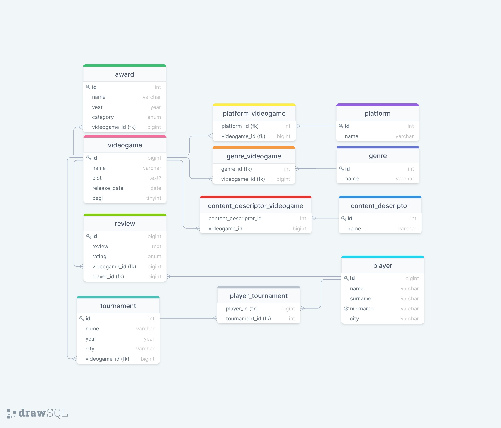

# DATABASE VIDEOGAMES
## [Drawsql link](https://drawsql.app/boolean-7/diagrams/db-videogames)

Table videogame:
- id: bigint, unsigned, **primary key**
- name: varchar(200), not null
- plot: text
- release_date: date, not null
- pegi: tinyint, unsigned, not null

Table platform:
- id: bigint, unsigned, **primary key**
- name: varchar(50), not null

Pivot table videogame_platform:
- videogame_id: bigint, unsigned, not null, **foreign key**
- platform_id: bigint, unsigned, not null, **foreign key**

Table category:
- id: bigint, unsigned, **primary key**
- name: varchar(50), not null

Pivot table videogame_category:
- videogame_id: bigint, unsigned, not null, **foreign key**
- category_id: bigint, unsigned, not null, **foreign key**

